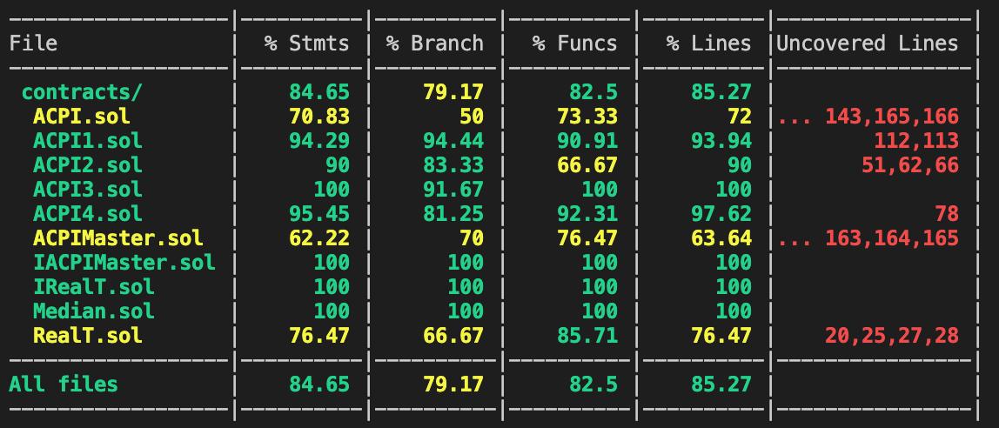
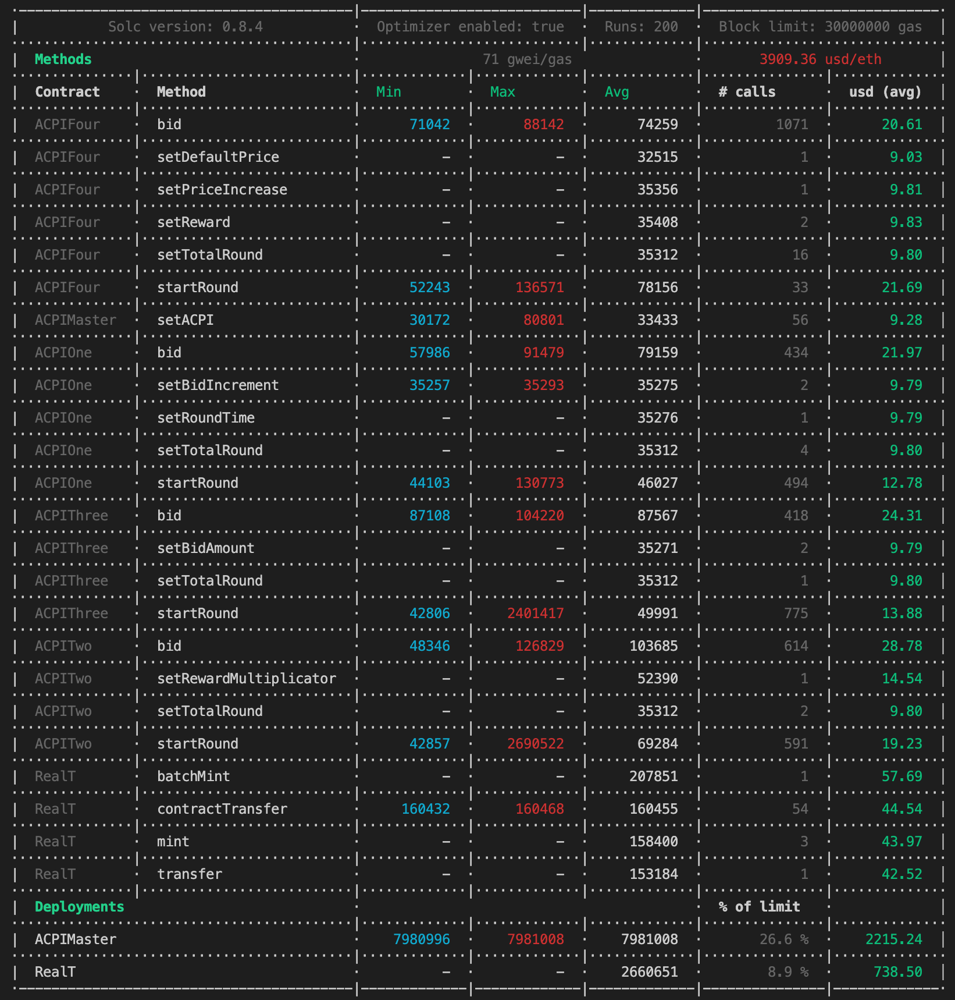

<div id="top"></div>

[![Contributors][contributors-shield]][contributors-url]
[![Forks][forks-shield]][forks-url]
[![Stargazers][stars-shield]][stars-url]
[![Issues][issues-shield]][issues-url]
[![MIT License][license-shield]][license-url]
[![LinkedIn][linkedin-shield]][linkedin-url]

<!-- PROJECT LOGO -->
<br />
<div align="center">
  <a href="https://github.com/real-token/Realtoken-protocol-v1-contract-step0">
    
  </a>

<h3 align="center">Real Estate Governance</h3>

  <p align="center">
    project_description
    <br />
    <a href="https://realt.co/"><strong>Realt.co</strong></a>
    <br />
    <br />
    <a href="https://github.com/real-token/Realtoken-protocol-v1-contract-step0">Live website</a>
    ·
    <a href="https://github.com/real-token/Realtoken-protocol-v1-contract-step0/issues">Report Bug</a>
    ·
    <a href="https://github.com/real-token/Realtoken-protocol-v1-contract-step0/issues">Request Feature</a>
  </p>
</div>


<!-- TABLE OF CONTENTS -->
<details>
  <summary>Table of Contents</summary>
  <ol>
    <li>
      <a href="#about-the-project">About The Project</a>
      <ul>
        <li><a href="#built-with-hardhat">Built With Hardhat</a></li>
      </ul>
    </li>
    <li>
      <a href="#getting-started">Getting Started</a>
      <ul>
        <li><a href="#prerequisites">Prerequisites</a></li>
        <li><a href="#installation">Installation</a></li>
      </ul>
    </li>
    <li><a href="#usage">Usage</a></li>
    <li><a href="#roadmap">Roadmap</a></li>
    <li><a href="#contributing">Contributing</a></li>
    <li><a href="#license">License</a></li>
    <li><a href="#contact">Contact</a></li>
    <li><a href="#acknowledgments">Acknowledgments</a></li>
  </ol>
</details>


<!-- ABOUT THE PROJECT -->
## About The Project

[![Product Name Screen Shot][product-screenshot]](https://example.com)

<p align="right">(<a href="#top">back to top</a>)</p>


### Built With Hardhat

* [Eslint](https://eslint.org/)
* [Chai](https://www.chaijs.com/guide/)
* [Solhint](https://github.com/protofire/solhint)
* [Prettier](https://github.com/prettier/prettier)
* [solidity-coverage](https://github.com/sc-forks/solidity-coverage)
* [dotenv](https://www.npmjs.com/package/dotenv)
* [Waffle](https://getwaffle.io/)
* [Typescript](https://www.typescriptlang.org/)

<p align="right">(<a href="#top">back to top</a>)</p>


<!-- GETTING STARTED -->
## Getting Started


### Prerequisites


* npm
  ```sh
  npm install npm@latest -g
  ```

### Installation

1. Clone the repo
   ```sh
   git clone https://github.com/real-token/Realtoken-protocol-v1-contract-step0.git
   ```
2. Install NPM packages
   ```sh
   npm install
   ```
3. Setup a `.env` file, with the following config

   >  CoinMarketCap API Key [here](https://coinmarketcap.com/api/pricing/)

   >  Infura API Key [here](https://infura.io/pricing)

   >  Etherscan API Key [here](https://etherscan.io/apis)

   ```sh
    ETHERSCAN_API_KEY=API-KEY
    ROPSTEN_URL=https://ropsten.infura.io/v3/API-KEY
    RINKEBY_URL=https://rinkeby.infura.io/v3/API-KEY
    KOVAN_URL=https://kovan.infura.io/v3/API-KEY
    XDAI_URL=https://rpc.xdaichain.com/
    XDAITEST_URL=https://sokol.poa.network
    REPORT_GAS=CoinMarketCap-API-Key
    TOKEN_ADMIN_PK=Token_Contract_Creator_Private_Key
    ACPI_MODERATOR=ACPI_Moderator_Private_Key
   ```

<p align="right">(<a href="#top">back to top</a>)</p>


<!-- USAGE EXAMPLES -->
## Usage

Once you are set, you are ready to run tests, compile, audit and deploy the Real Estate Governance Smart Contract suite.

+ Run tests
```sh
npx hardhat test
```
+ Check coverage
```sh
npx hardhat coverage
```
+ Verify deployed smart contract on Etherscan
```sh
npx hardhat verify CONTRACT_ADDRESS --network NETWORK_ID
```
+ Deploy and verify on network
```sh
npx hardhat run scripts/deploy.ts --network NETWORK_ID
```

> NETWORK_ID is specified inside [config](hardhat.config.ts)
<p align="right">(<a href="#top">back to top</a>)</p>

<!-- AUDIT -->
## Audit

Auditing the solidity code in an important aspect of this language, we need to be confident with the code we ship to the customer to avoid malicious attacks

A lot of the auditing have been done during the contract construction using the `Solidity static analysis framework` [**Slither**](https://github.com/crytic/slither)

You can download Slither and use the following command to _audit_ the code

```sh
slither .
```
<p align="right">(<a href="#top">back to top</a>)</p>


<!-- ROADMAP -->
## Roadmap

- Main contract ✅
- ACPI 1 ✅
- ACPI 2 ✅
- ACPI 3 ✅
- ACPI 4 ✅

See the [open issues](https://github.com/real-token/Realtoken-protocol-v1-contract-step0/issues) for a full list of proposed features (and known issues).

<p align="right">(<a href="#top">back to top</a>)</p>


<!-- COVERAGE -->
## Coverage



<p align="right">(<a href="#top">back to top</a>)</p>

<!-- MASS TESTING -->
## End2End Testing

> In order to ensure the reliability of our contract, we designed an end-to-end test that features 100 users across each of the 4 ACPIs. It verifies that the price for all ACPIs matches and the rewards are all in line.

> The report is available [here](https://docs.google.com/spreadsheets/d/15VrGhLZ6GQ370HacbFeNl1vms_BwhxSOSbxK2alWs2E/edit?usp=sharing)

Use the following command to start the test

```
npx hardhat test test/end2end
```

The following syntax will appear in the report:

```
102: 5.332486580477705241 - 0.262922728291408962 - 13.15
```

+ **102** is the index of the user you can referer to the report [result tab](https://docs.google.com/spreadsheets/d/15VrGhLZ6GQ370HacbFeNl1vms_BwhxSOSbxK2alWs2E/edit#gid=1071362346)

+ **The first value 5.3324...** : `tokenToClaim` value, what the user will be able to withdraw at the end of the ACPI event, you can check that value in the report

+ **The second value 0.2629...** is the amount of tokens rewarded by the bids that were not the top bidder during **ACPI #1** you can check that value in the report as `PendingReturns`

+ **The third value 13.15** : The total of bids that were not the top bidder during ACPI #1 **ACPI #1**

## Following the ACPI event, user #102 will be able to collect the sum of his winnings, for example: <ins>~5.33249 REG</ins>
<p align="right">(<a href="#top">back to top</a>)</p>

<!-- GAS FEES -->
## Gas fees



<p align="right">(<a href="#top">back to top</a>)</p>

<!-- CONTRIBUTING -->
## Contributing


If you have a suggestion that would make this better, please fork the repo and create a pull request. You can also simply open an issue with the tag "enhancement".
Don't forget to give the project a star! Thanks again!

1. Fork the Project
2. Create your Feature Branch (`git checkout -b feature/AmazingFeature`)
3. Commit your Changes (`git commit -m 'Add some AmazingFeature'`)
4. Push to the Branch (`git push origin feature/AmazingFeature`)
5. Open a Pull Request

<p align="right">(<a href="#top">back to top</a>)</p>


<!-- LICENSE -->
## License

Distributed under the MIT License. See `LICENSE.txt` for more information.

<p align="right">(<a href="#top">back to top</a>)</p>


<!-- CONTACT -->
## Contact

Support - [@RealTPlatform](https://twitter.com/RealTPlatform) - support@realt.co

Project Link: [https://github.com/real-token/Realtoken-protocol-v1-contract-step0](https://github.com/real-token/Realtoken-protocol-v1-contract-step0)

<p align="right">(<a href="#top">back to top</a>)</p>


<!-- ACKNOWLEDGMENTS -->
## Acknowledgments

* [Hardhat Team](https://hardhat.org/)
* [Haytham Allos - CTO # Off Chain Oracle](https://www.linkedin.com/in/haythamallos/)
* [Michael Courvoisier - COO # Guidelines](https://github.com/Michael-RealT)
* [Bastien Silhol - Solidity code](https://github.com/chichke)
* [Nathan Quesseveur - Front end](https://www.linkedin.com/in/nathan-quesseveur-221a12145)

<p align="right">(<a href="#top">back to top</a>)</p>


<!-- MARKDOWN LINKS & IMAGES -->
<!-- https://www.markdownguide.org/basic-syntax/#reference-style-links -->
[contributors-shield]: https://img.shields.io/github/contributors/real-token/Realtoken-protocol-v1-contract-step0.svg?style=for-the-badge
[contributors-url]: https://github.com/real-token/Realtoken-protocol-v1-contract-step0/graphs/contributors
[forks-shield]: https://img.shields.io/github/forks/real-token/Realtoken-protocol-v1-contract-step0.svg?style=for-the-badge
[forks-url]: https://github.com/real-token/Realtoken-protocol-v1-contract-step0/network/members
[stars-shield]: https://img.shields.io/github/stars/real-token/Realtoken-protocol-v1-contract-step0.svg?style=for-the-badge
[stars-url]: https://github.com/real-token/Realtoken-protocol-v1-contract-step0/stargazers
[issues-shield]: https://img.shields.io/github/issues/real-token/Realtoken-protocol-v1-contract-step0.svg?style=for-the-badge
[issues-url]: https://github.com/real-token/Realtoken-protocol-v1-contract-step0/issues
[license-shield]: https://img.shields.io/github/license/real-token/Realtoken-protocol-v1-contract-step0.svg?style=for-the-badge
[license-url]: https://github.com/real-token/Realtoken-protocol-v1-contract-step0/blob/master/LICENSE.txt
[linkedin-shield]: https://img.shields.io/badge/-LinkedIn-black.svg?style=for-the-badge&logo=linkedin&colorB=555
[linkedin-url]: https://www.linkedin.com/company/realtplatform/
[product-screenshot]: images/screenshot.png